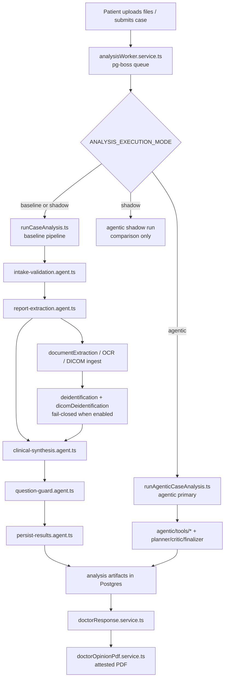

# SecondOp Backend Architecture

This is the onboarding map for `secondop-backend-agentic`. For local setup, use the **workspace root** `README.md` quickstart.

## Case-analysis data flow

| Stage | Primary paths |
|-------|----------------|
| Queue / worker | `src/services/analysisWorker.service.ts` |
| Baseline entry | `src/agents/case-analysis/runCaseAnalysis.ts` → `src/agents/core/agent.orchestrator.ts` |
| Agentic entry | `src/agentic/orchestration/runAgenticCaseAnalysis.ts` |
| Intake | `src/agents/case-analysis/intake-validation.agent.ts` |
| Extraction | `src/agents/case-analysis/report-extraction.agent.ts`, `src/services/reportExtraction.service.ts`, `src/services/documentExtraction.service.ts` |
| DICOM ingest | `src/services/imagingStudyIngest.service.ts` |
| De-id (text) | `src/services/deidentification.service.ts`, `presidio.client.ts`, `deidVault.service.ts` |
| De-id (DICOM) | `src/services/dicomDeidentification.service.ts` |
| Synthesis | `src/agents/case-analysis/clinical-synthesis.agent.ts`, `src/services/analysis.service.ts` |
| Question guard | `src/agents/case-analysis/question-guard.agent.ts` |
| Persist | `src/agents/case-analysis/persist-results.agent.ts` |
| LLM gateway | `src/ai/llmGateway.ts`, `src/ai/llmRequestMetadata.ts` |
| Clinician review | `src/services/doctorResponse.service.ts`, `src/controllers/case.controller.ts` |
| Attested PDF | `src/services/doctorOpinionPdf.service.ts` |

## The two-orchestrator story (read this first)

SecondOp has **two analysis runtimes**. This is the #1 source of confusion in the repo.

| Runtime | Where | Role |
|---------|--------|------|
| **Baseline** | `src/agents/core/agent.orchestrator.ts` + `src/agents/case-analysis/*` | Sequential five-step pipeline (`runAgentPipeline`). Still the code path for `baseline` and for the user-facing result in `shadow` mode. |
| **Agentic** | `src/agentic/` (native loop by default; optional LangGraph via `AGENTIC_RUNTIME=langchain`) | Planner / tools / critic / finalizer. Can be primary, shadow-only, or off. |

Mode switch: `src/agentic/core/executionMode.ts` ← env `ANALYSIS_EXECUTION_MODE`:

| Mode | User-facing result | Also runs |
|------|-------------------|-----------|
| `baseline` | Baseline orchestrator | — |
| `shadow` | Baseline | Agentic in parallel; comparison stored (`case_analysis_shadow_results`, migration `007_agentic_shadow_results.sql`) |
| `agentic` | Agentic | — |

**Authoritative today**

- Worker picks the primary engine in `analysisWorker.service.ts` (`getPrimaryRunEngine`): `agentic` only when mode is `agentic`; otherwise baseline.
- Code default if the env var is **unset**: `baseline` (`resolveExecutionMode`).
- `.env.example` currently sets `ANALYSIS_EXECUTION_MODE=agentic` (local/dev template prefers agentic primary).
- Production may differ — always check the deployed env, not folder names.
- LangGraph (`AGENTIC_RUNTIME=langchain`) is an **alternate agentic runtime**, not the default (`native`). See `docs/LANGGRAPH_RUNTIME.md`.

**Migration intent (Phase 3 — blocked)**

- Collapse `src/agents/`, `src/agentic/`, and `src/ai/` into one `src/ai/` tree **only after** a human confirms shadow/agentic parity vs baseline (Linear **SEC-102**).
- Until then: keep both runtimes; do not delete `agent.orchestrator.ts` based on folder aesthetics.

## Storage model

- Uploaded files are stored on disk under `UPLOAD_DIR` (default `./uploads` locally).
- Path resolution is centralized in `src/utils/uploadPath.ts` (`resolveUploadDir`, `resolveStoredFilePath`) so upload, download, and extraction agree on one root.
- On Railway, a **Volume** is mounted at `/data/uploads` with `UPLOAD_DIR=/data/uploads`. Without a volume, container disk is ephemeral and files disappear on redeploy (see `docs/decisions/2026-07-storage-railway-volume.md`).

## De-identification model

- **Text:** Presidio analyzer/anonymizer (`docker compose --profile deid`). Orchestrated by `deidentification.service.ts`; vault in `deidVault.service.ts` / migration `020_case_analysis_deid_vault.sql`.
- **DICOM:** Tag scrubbing in `dicomDeidentification.service.ts` (+ vault migration `022_*`).
- **Fail-closed when enabled:** if de-id is required and fails, analysis must not proceed with identified content. Default in `.env.example` is often ship-dark (`DEID_ENABLED=false`) until Presidio is up — check env before assuming de-id is active.
- Spec history: `docs/decisions/2026-07-presidio-deidentification.md`.

## Auth model

- JWT access + refresh tokens issued in `src/controllers/auth.controller.ts`.
- Middleware: `src/middleware/auth.ts` — `authenticate`, `authorize('patient' | 'doctor')`.
- Command Center uses a separate allowlist middleware: `src/middleware/commandCenterAuth.ts`.
- Practice/team membership is orthogonal to JWT role (`src/services/practice.service.ts`).

## Cross-cutting

| Concern | Paths |
|---------|--------|
| Contract / critic evals | `src/evals/`, `npm run eval:harness` |
| Phoenix tracing | `src/observability/phoenix.service.ts` |
| Mission Control / Command Center API | `src/routes/commandCenter.routes.ts`, `src/services/commandCenter.service.ts` |
| Agent run ledger | `docs/AGENT_RUN_LEDGER.md` |

## Out of scope (onboarding)

No monorepo tooling, no package extraction, no AI directory collapse until **SEC-102** decision.
